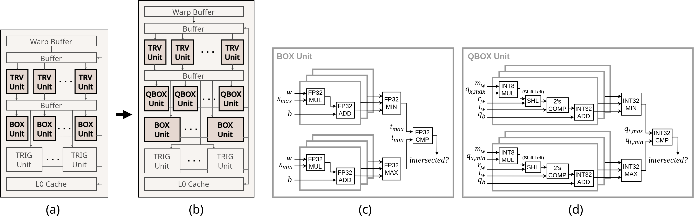

# AQB8: Energy-Efficient Ray Tracing Accelerator through Multi-Level Quantization

**Yen-Chieh Huang, Chen-Pin Yang, Tsung Tai Yeh**  
*The 52nd Annual International Symposium on Computer Architecture (ISCA), June 21–25, 2025, Tokyo, Japan.*

\[[paper](https://guthib.com/)\]

## Introduction

**AQB8** is a ray tracing accelerator designed to operate on quantized BVH trees using a novel multi-level quantization technique. This approach enables ray traversal to use low-bit integer arithmetic, significantly reducing reliance on FP32 operations. The hardware is simpler and more area- and energy-efficient.

**Key benefits:**
- 70% reduction in DRAM accesses  
- 49% reduction in energy consumption  
- 27% reduction in hardware area  
- 1.82× performance speedup over modern GPU RT accelerators



> Architectural modifications from a (a) baseline RT accelerator to our (b) quantized RT accelerator. The hardware block diagrams for the BOX and QBOX units are detailed in (c) and (d), respectively.

## AQB8 on Vulkan-Sim

[](https://hub.docker.com/r/ycpin/aqb8-vulkan-sim)

We provide a Docker image to run AQB8 on [Vulkan-Sim](https://github.com/ubc-aamodt-group/vulkan-sim).  
> Make sure [Docker](https://docs.docker.com/get-docker/) is installed before proceeding.

## Quick Start

Run with the included script:

```bash
chmod +x docker_run.sh
./docker_run.sh
```

### `docker_run.sh` example:

```bash
#!/bin/bash

# docker_run.sh - Run the AQB8 Vulkan-Sim Docker container

IMAGE="ycpin/aqb8-vulkan-sim"
CONTAINER_NAME="aqb8-vulkan-sim-container"

echo "Pulling Docker image: $IMAGE"
docker pull "$IMAGE"

echo "Running Docker container: $CONTAINER_NAME"
docker run -it --rm --name "$CONTAINER_NAME" "$IMAGE"
```

## Inside the Container

The image contains six implementations of AQB8 on Vulkan-Sim, covering baseline, compressed, and `quantized versions (AQB8)`, each with 2-wide and 6-wide BVH trees:

```
/home/
├── vulkan-sim-baseline-2wide/
├── vulkan-sim-baseline-6wide/
├── vulkan-sim-compress-2wide/
├── vulkan-sim-compress-6wide/
├── vulkan-sim-quantized-2wide/
└── vulkan-sim-quantized-6wide/
```

## Usage Instructions

Navigate to one of the simulation folders, e.g.:

```bash
cd /home/vulkan-sim-quantized-2wide/vulkan-sim-root/
```

### Step 1: Load Environment Variables

```bash
source embree-3.13.4.x86_64.linux/embree-vars.sh
```

### Step 2: Build Vulkan-Sim + Mesa

```bash
cd vulkan-sim/
source setup_environment

cd ../mesa-vulkan-sim/
meson --prefix="${PWD}/lib" build -Dvulkan-drivers=swrast -Dgallium-drivers=swrast -Dplatforms=x11 -D b_lundef=false -D buildtype=debug
ninja -C build/ install  # May fail the first time — this is expected

export VK_ICD_FILENAMES=${PWD}/lib/share/vulkan/icd.d/lvp_icd.x86_64.json

cd ../vulkan-sim/
make -j

cd ../mesa-vulkan-sim/
ninja -C build/ install  # This second build should succeed
```

### Step 3: Build the Ray Tracing App

```bash
cd ../RayTracingInVulkan/
./build_linux.sh
```

### Step 4: Run Simulations

```bash
cd ..
bash rt_program_128.sh  # Resolution: 128x128
bash rt_program_256.sh  # Resolution: 256x256
```

Output logs and results are located in: 
`/RayTracingInVulkan/build/linux/bin/`

## Citation

If you use AQB8 in your research, please cite our ISCA 2025 paper:

```bibtex
@inproceedings{huang2025aqb8,
  title     = {AQB8: Energy-Efficient Ray Tracing Accelerator through Multi-Level Quantization},
  author    = {Yen-Chieh Huang and Chen-Pin Yang and Tsung Tai Yeh},
  booktitle = {Proceedings of the 52nd Annual International Symposium on Computer Architecture (ISCA)},
  year      = {2025},
  address   = {Tokyo, Japan}
}
```

## Contact

For questions or collaborations, please open an issue or contact the authors directly.
